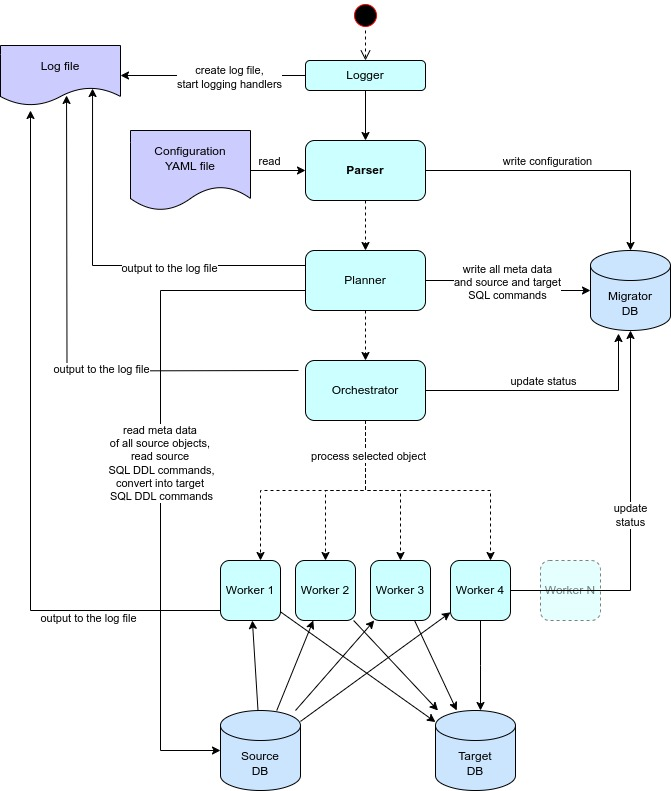

# credativ-pg-migrator


`credativ-pg-migrator` is a solution for the migration of databases from legacy systems to PostgreSQL.
It is is written in Python in multiple classes and modules.
For practical usage and examples refer to the [tests](./tests/) directory. There you can find working examples of the migration process for different databases.

## Main features

- Pure python solution, uses only standard libraries, structured in modules, written in object-oriented style in classes
- Currently supported source databases are:
  - IBM dDB2 LUW
  - Informix
  - MS SQL Server
  - MySQL/MariaDB (engines with INFORMATION_SCHEMA)
  - Oracle
  - PostgreSQL (mainly for special use cases)
  - SQL Anywhere
  - Sybase ASE
- Supports migration of tables, column constraints and defaults, data, primary keys, secondary indexes, foreign keys, functions/procedures, triggers and views from source to target database
- If tables have sequences, migrator sets current values of sequences on the target database
- Migration of views is currently only in rudimentary version, just replacing source schema names in code with target schema names
- Conversion and migration of functions, procedures, triggers currently fully works for Informix. Can be added on demand for other databases too.
- Migrator allows customizable substitutions of data types, default values of columns, calls of remote objects.
- User can also define limitations for migration of data - as where conditions for tables. This option requires good analysis of dependencies in the source database. Missing data can break Foreign Key constraints in the target database. See further in the documentation.
- Migrator provides reach logging and error handling, has 2 levels of logging - INFO and DEBUG, in case of error, detailed error message is printed.
- By default logging messages are printed both to console and to log file, name of the log file is configurable in command line arguments.
- Rich information is also logged to the migration database - see below.

## Usage

In a python venv:
```
. ../migrator_venv/bin/activate
echo ""> ../logs/test_database_20250306.log; python3 main.py --config=../config/test_database.yaml --log-file=../logs/test_database_$(date +%Y%m%d).log --log-level=DEBUG
```

From packages:

```
credativ-pg-migrator --config=./test_database.yaml --log-file=./test_database_$(date +%Y%m%d).log --log-level=INFO
```

## Configuration file

- Configuration file is a YAML file
- Settings available in the config file are described in [config_sample.yaml](./config_sample.yaml) file

## Architecture



## Source databases

- Source database connector must implement DatabaseConnector class from the [credativ-pg-migrator.database_connector](./credativ-pg-migrator/database_connector.py) module
- Methods of this class contain descriptions of actions and return values that are expected by the migrator tool
- Supported databases should be accessed via ODBC, JDBC or native python libraries. Not all options are available for all databases.
- See feature matrix in [FEATURE MATRIX](./FEATURE_MATRIX.md) for supported features in different database connectors.

## Target databases

- Target database connector must implement DatabaseConnector class from the migrator.database_connector module
- Solution currently supports only PostgreSQL as target database

## Migration database

- Solution uses a migration database to store metadata about the migration process
- Migration database is a PostgreSQL database, credentials must be configured in the configuration file
- In most cases we assume that the migration database will the same as the target database, but it is fully possible to use a different database from the same or different PostgreSQL server
- Migration protocol tables contain detailed information about all migrated objects, like source code, target code, success or failure of migration, etc.

## Changes

See [CHANGELOG](./CHANGELOG.md).

## TODO

- In Informix we currently do not support ROW data type (corresponds with PostgreSQL composite type)
- Not all types of default values are currently supported simply because we do not know all possible values/functions. Every database is somehow unique, so these will be added on demand.
- Support for partitioning of target tables is only in the experimental stage.

## Automated GitHub tests

- Testing examples in the [tests directory](./tests/) can automatically run on GitHub using GitHub Actions
- Directory must have "run_full_test.sh" script, which must be executable and must be able to run full test automatically
- To activate GitHub tests you must add text `[run-tests]` in the commit message and specify either `[all]` or specific database like `[mysql]`, `[oracle]`, etc.

## Build

```
../migrator_venv/bin/pyinstaller --onefile --name credativ-pg-migrator main.py
```

## Manual test of code conversion

```
../migrator_venv/bin/python3 test_code_conversion.py
```

- Repository contains python solution for migration of the whole database from legacy systems to PostgreSQL.
- Testing examples are in the [tests directory](./tests/) - see [README](./tests/README.md) for more information and READMEs in each subdirectory.

## Structure of the repository

The repository is structured as follows:

- config - different configuration files for the migrator tool
- lib - different libraries used by the migrator tool - java jdbc drivers, C++ client libraries, etc.
- logs - log files generated by the migrator tool
- credativ_pg_migrator - the main codebase for the migrator tool
- poc - multiple isolated scripts for testing different functionalities of the migrator tool during development
- scripts - different bash scripts for the migrator tool
- sql - SQL scripts different purposes like for creating tables and inserting data into the source database
- tests - test cases for the migrator tool for different source databases

## Authors

`credativ-pg-migrator` has been primarily developped and is maintained by Josef Machytka, see [AUTHORS](AUTHORS.md).

## License

`credativ-pg-migrator` is released under the GNU General Public License, version 3 (or any later version).
See the file [COPYING](./COPYING) in the distribution for details.
